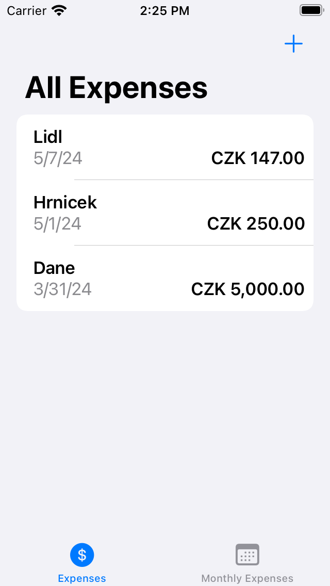
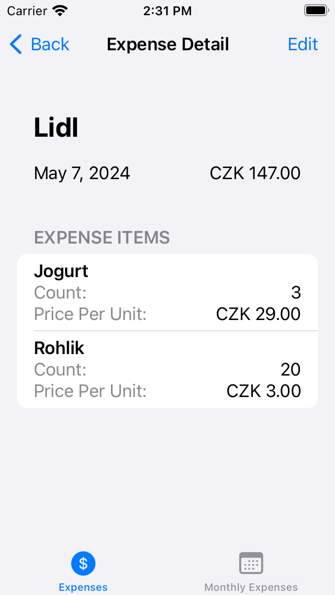
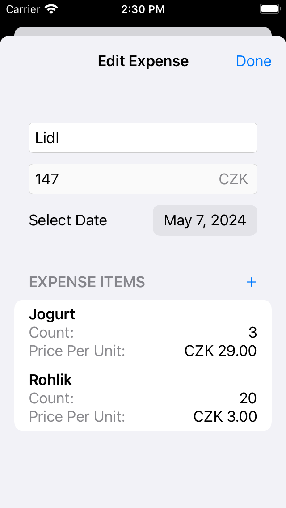
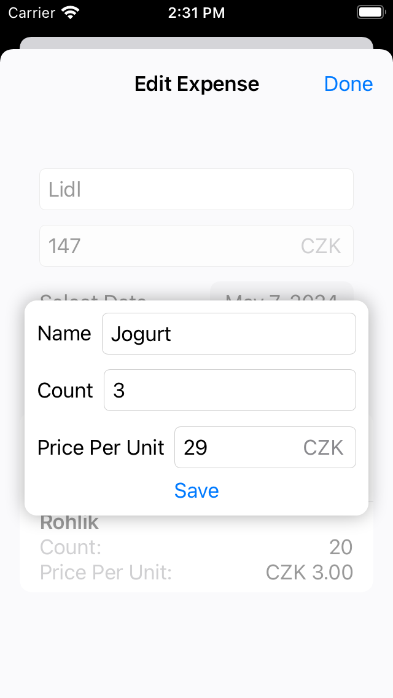
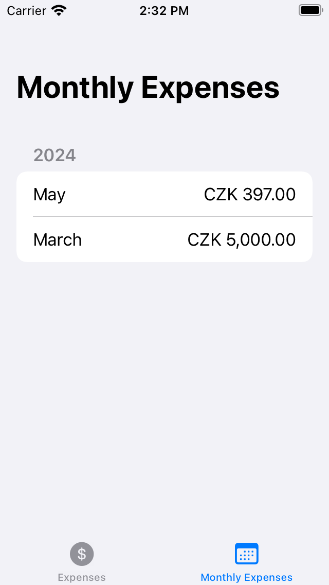

Autor: Jan Klanica
Login: xklani00
github: https://github.com/jklanica/IZA_project_CoinTracker

# Záznamník výdajů

V rámci projektu do IZA jsem se rozhodl udělat aplikaci na iOS umožňující uživateli zaznamenávat své výdaje a vést si tak přehled o všech svých výdajích.

## Koncept a struktura

Celá aplikace se skládá z dvou hlavních View: `ExpenseListView` a `MonthlyExpensesView`. V tom prvním si uživatel může zapisovat své výdaje, v tom druhém dostane přehled o tom, jaké výdaje měl v jakém měsíci kterého roku.

Výdaj jako takový se skládá mimo jiné i z položek. Cena výdaje se dá tedy zadat přímo pro celý výdaj, nebo pokud výdaj obsahuje nějaké položky, je výsledkem součtu všech položek.

Přístup k datům a jejich editace/mazání je naimplementovaná způsobem probíraným na přednáškách.

## Vývojové prostředí a použité knihovny

Napříč tomu, že jsem primárně Windows user, byl jsem díky své zásluze schopen vyvíjet aplikaci na starším macOS 12.0.1 a tudíž i prostřednictvím starší verze XCode 13.4.1. Z toho vyplývá, že jsem nemohl použít všechny nejmodernější knihovny, které dnes existují. Můj základní stack tedy tvořila knihovna CoreData a SwiftUI.

Zároveň bych rád požádal o skromnost vůči hodnocení designu, neb jediný build mé aplikace trval bezmála 10 minut. Dovedete si tudíž představit, jakou radost mám, že mi po dokončení projektu zůstalo pár vlasů na hlavě (zřejmě používám kvalitní šampón a nepodařilo se mi je všechny vytrhat :D).

Jsem si vědom, že existovala varianta zadání, kde nebylo nutné dělat aplikaci ve SwiftUI, ale když už jsem se to učil, tak jsem si to i přes všechnu bolest chtěl vyzkoušet.

Pro příští generace v mém postavení bych doporučil vypůjčit si virtualizovaný mac, např. https://www.macincloud.com/. Pokud to funguje, tak jak píšou, mělo by to za ty peníze ušetřit spoustu starostí.

## Chybové stavy

Pokud v aplikace nastane nějaká chyba (většinou nejde uložit kontext), vyskočí na obrazovce alert s upozorněním o chybě. Samotný alert se vkládá do aplikace ve view na nejvyšší úrovni. Je možné ho nastavit pomocí singletonu, který drží aktuální alert jako hodnotu (popřípadě nil).

## Fotky

    <figure style="max-width: 20rem">
        
        <figcaption>All expenses</figcaption>
    </figure>
    <figure style="max-width: 20rem">
        
        <figcaption>Expense detail</figcaption>
    </figure>
    <figure style="max-width: 20rem">
        
        <figcaption>Edit expense</figcaption>
    </figure>
    <figure style="max-width: 20rem">
        
        <figcaption>Edit expense item</figcaption>
    </figure>
    <figure style="max-width: 20rem">
        
        <figcaption>Monthly expenses</figcaption>
    </figure>

